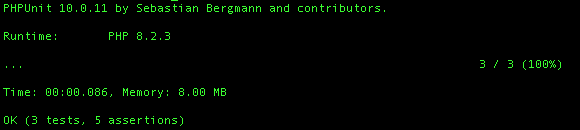

# PHP Command Line Operator
This PHP library can be used to invoke a certain method of a PHP class using terminal with the attributes. Please check the example below.

## Usage
- Create a file called `cmd.php` file. This file will be invoked by the terminal command
```
<?php
use chamithlkml;
require_once '/path/to/your/console_class.php';
require_once '/path/to/lib/cmd_operator.php';

$my_console_app = new YourConsoleClass();
$command_operator = new CmdOperator($my_console_app);
$response = $command_operator->call_method();
```
Lets's assume your console app implementation has a public method called `custom_method`
```
class YourConsoleApp{

    public function custom_method($param1=0, $param2=''){
        // Your method implementation
    }
}
```
You may call this method `custom_method` in command line as below
```
php cmd.php --custom_method --param1 100 --param2 abcd
```

## Running Unit Tests
- Install composer by referring to [Composer Docs](https://getcomposer.org/download/)
- Run composer
```
composer install
./vendor/bin/phpunit unit_tests
```


## Docker container
```
docker pull chamithlkml/php-cmd-line-operator
```